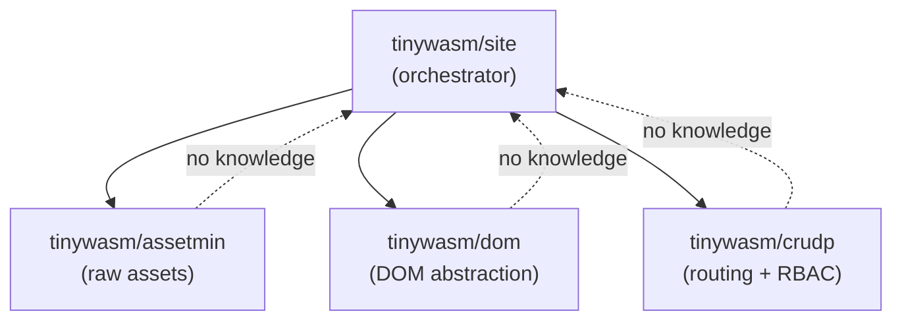

# Architecture

`tinywasm/site` is a modular rendering engine designed for isomorphic Go applications. It bridges the gap between server-side rendering (SSR) and client-side WebAssembly (WASM) interactivity.

## Core Principles

- **Isomorphic Core**: Sharing models and logic between server and client.
- **SSR-First, SPA-Enabled**: Ability to render initial HTML on the server for SEO and speed, while enabling SPA functionality via WASM.
- **No Templates**: Logic-driven UI construction using Go code and `tinywasm/dom`.
- **Zero Configuration Assets**: Automatic bundling of CSS, JS, and SVG via `tinywasm/assetmin`.

## Component Relationship

## Registration System

Registration is orchestrated by `tinywasm/site` to ensure consistent behavior across environments:

- `register.go`: Defines `AddModules()` to register handlers.
- `register.back.go` (`!wasm`): Implements `Build(am *assetmin.AssetMin)` to extract assets and inject HTML/Navigation into the body.
- `register.front.go` (`wasm`): Handles client-side mounting and SPA navigation.

## Execution Flow

1. **Server (!wasm)**:
    - `site.AddModules()` registers component handlers.
    - `site.Build(am)` orchestrates the SSR flow:
        - Injects auto-generated navigation based on `HandlerName()`.
        - Extracts CSS/Icons via `assetmin.AddCSS()` and `assetmin.AddIcon()`.
        - Injects module HTML (SSR) for public components.
2. **Client (wasm)**:
    - Registers same Modules.
    - Mounts the active Module to the DOM via `tinywasm/dom`.
    - Intercepts navigation to update the view without full page reload.

---
**Status**: Partially Implemented
