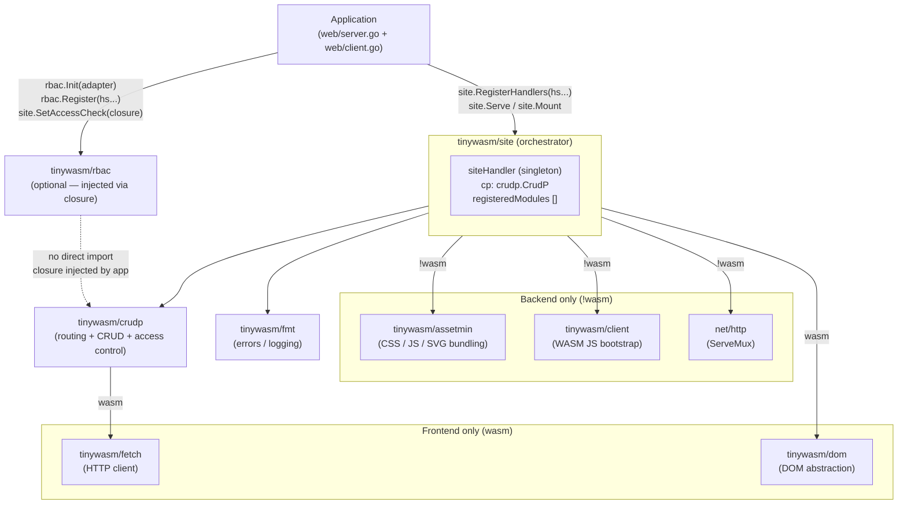

# Architecture

> **Status:** Current — February 2026

`tinywasm/site` is an isomorphic Go rendering engine. It acts as a singleton orchestrator
that wires together routing, asset bundling, DOM rendering, and access control. None of its
dependencies import it.

## Core Principles

- **Isomorphic Core:** Same module structs compile for both server (`!wasm`) and client (`wasm`).
- **SSR-First, SPA-Enabled:** Server renders initial HTML; WASM client hydrates and handles navigation.
- **No Templates:** UI built with Go code via `tinywasm/dom`.
- **Zero Configuration Assets:** Automatic CSS/JS/SVG bundling via `tinywasm/assetmin`.
- **rbac optional:** Access control can be wired via a closure without importing rbac.

---

## Component Relationships



---

## Architecture Layers

```
┌────────────────────────────────────────────────────────────┐
│  Application  (web/server.go  +  web/client.go)            │
│  rbac.Init(adapter) / rbac.Register(hs...)   [optional]    │
│  site.SetAccessCheck(closure)                [optional]    │
│  site.RegisterHandlers(modules.Init()...)                  │
│  site.Serve(":8080")     /     site.Mount("app")           │
└────────────────────────────┬───────────────────────────────┘
                             │ calls
┌────────────────────────────▼───────────────────────────────┐
│  tinywasm/site  (singleton orchestrator)                   │
│                                                            │
│  Public API:                                               │
│  RegisterHandlers / SetUserRoles / SetAccessCheck          │
│  SetCacheSize / SetDefaultRoute / SetDevMode               │
│  Serve (!wasm)  /  Mount  /  Navigate (wasm)               │
├────────────────────────────────────────────────────────────┤
│  Internal files                                            │
│  site.go  register.go  config.go  module.go  manager.go   │
│  ssr.build.go  mount.back.go  mount.front.go               │
│  site.back.go  manager_wasm.go                             │
│  register_ssr.go  register_wasm.go  serve.go               │
├──────────┬─────────────┬────────────┬────────┬────────────┤
│  crudp   │  assetmin   │  client    │  dom   │  fmt       │
│  routing │  CSS/JS/SVG │  WASM JS   │  DOM   │  errors    │
│  CRUD    │  (!wasm)    │  (!wasm)   │  (wasm)│  logging   │
│  access  │             │            │        │            │
└──────────┴─────────────┴────────────┴────────┴────────────┘
```

**Read path (hot — wasm):** module navigation → `manager.go` → `dom` → browser DOM
**Write path (HTTP):** request → `crudp` routes → handler → response
**Init path (!wasm):** `RegisterHandlers` → `ssrBuild` → `assetmin` + `crudp.RegisterRoutes`

---

## Build Tag Split

| File | Tag | Responsibility |
|------|-----|----------------|
| `site.go` | — | Singleton `siteHandler`, public API delegation |
| `site.back.go` | `!wasm` | SSR interfaces: `CSSProvider`, `JSProvider`, `IconSvgProvider` |
| `config.go` | — | Configuration values (`CacheSize`, `DefaultRoute`, `OutputDir`) |
| `module.go` | — | `Module`, `Parameterized`, `ModuleLifecycle` interfaces |
| `manager.go` | — | Module LRU cache, route matching |
| `manager_wasm.go` | `wasm` | WASM client navigation and hydration logic |
| `register.go` | — | `RegisterHandlers()`, module list accumulation |
| `register_ssr.go` | `!wasm` | Asset extraction and collection per handler |
| `register_wasm.go` | `wasm` | No-op asset register (WASM has no asset pipeline) |
| `serve.go` | `!wasm` | `Serve()` one-liner: `NewServeMux + Mount + ListenAndServe` |
| `mount.back.go` | `!wasm` | `Mount()` backend: assetmin + crudp route registration |
| `mount.front.go` | `wasm` | `Mount()` frontend: `InitClient + Start + select{}` |
| `ssr.build.go` | `!wasm` | `ssrBuild()`: CSS/JS/SVG/HTML injection into assetmin |

---

## Public API

```go
// Configuration — call before RegisterHandlers
func SetUserRoles(fn func(data ...any) []byte)
func SetAccessCheck(fn func(resource string, action byte, data ...any) bool)
func SetCacheSize(size int)        // default: 3
func SetDefaultRoute(route string) // default: "home"
func SetOutputDir(dir string)      // default: "./public"
func SetDevMode(enabled bool)

// Registration
func RegisterHandlers(handlers ...any) error

// Serving
func Serve(addr string) error          // !wasm: one-liner
func Mount(mux *http.ServeMux) error   // !wasm: register with existing mux
func Mount(parentID string) error      // wasm: hydrate DOM, blocks forever
func Navigate(parentID, hash string) error  // wasm: SPA navigation

// Utility
func GetUserData() (name, area string) // reads from registered modules
```

---

## Module Interfaces

| Interface | Methods | Source package | When used |
|-----------|---------|---------------|-----------|
| `Module` | `HandlerName() string`<br>`ModuleTitle() string`<br>`dom.Component` | `site` | Required for navigable modules |
| `Parameterized` | `SetParams(params []string)` | `site` | Routes with path params (`#route/param`) |
| `ModuleLifecycle` | `BeforeNavigateAway() bool`<br>`AfterNavigateTo()` | `site` | Navigation hooks |
| `CSSProvider` | `RenderCSS() string` | `site` (!wasm) | Per-module CSS injection |
| `JSProvider` | `RenderJS() string` | `site` (!wasm) | Per-module JS injection |
| `IconSvgProvider` | `IconSvg() map[string]string` | `site` (!wasm) | SVG sprite injection |
| `AccessLevel` | `AllowedRoles(action byte) []byte` | `crudp` | Standalone RBAC mode |
| `DataValidator` | `ValidateData(action byte, data ...any) error` | `crudp` | Required for CRUD handlers |
| `NamedHandler` | `HandlerName() string` | `crudp` | Required for CRUD routing |

---

## SSR vs SPA Rendering Decision

The rendering mode per module is determined by `AllowedRoles('r')` at startup:

| `AllowedRoles('r')` returns | Render mode | Reason |
|-----------------------------|-------------|--------|
| `[]byte{'*'}` | **SSR** — full HTML on server | Public content: SEO + fast first paint |
| specific roles (e.g. `['a','e']`) | **SPA** — WASM client renders | Private content: auth required before display |

---

## rbac Integration (optional)

`tinywasm/rbac` is **not a direct dependency** of `tinywasm/site`. Integration is wired by
the application layer via a closure. The `site` package only exposes the `SetAccessCheck` hook.

```go
// web/server.go — application initialization (rbac mode)
rbac.SetLog(log.Println)
if err := rbac.Init(adapter); err != nil {
    log.Fatal(err)
}

// Seed roles (idempotent)
rbac.CreateRole(unixid.New(), 'a', "Admin",   "Full system access")
rbac.CreateRole(unixid.New(), 'e', "Editor",  "Content management")
rbac.CreateRole(unixid.New(), 'v', "Visitor", "Read-only access")

// Register handler permissions from AllowedRoles() (idempotent)
hs := modules.Init()
if err := rbac.Register(hs...); err != nil {
    log.Fatal(err)
}

// Wire rbac into site's access control
site.SetAccessCheck(func(resource string, action byte, data ...any) bool {
    for _, d := range data {
        if req, ok := d.(*http.Request); ok {
            userID := req.Header.Get("X-User-ID")
            ok, _ := rbac.HasPermission(userID, resource, action)
            return ok
        }
    }
    return false
})

// Register handlers (same slice — no duplication)
if err := site.RegisterHandlers(hs...); err != nil {
    log.Fatal(err)
}
site.Serve(":8080")
```

See [ACCESS_CONTROL.md](ACCESS_CONTROL.md) for both access control modes.
See [rbac CRUDP_INTEGRATION diagram](../../rbac/docs/diagrams/CRUDP_INTEGRATION.md) for the
full request-phase flow.

---

## Dependencies

```
tinywasm/site
├── github.com/tinywasm/crudp      # routing + CRUD + access control (all builds)
├── github.com/tinywasm/fmt        # errors and logging (all builds)
├── github.com/tinywasm/assetmin   # CSS/JS/SVG bundling (!wasm)
├── github.com/tinywasm/client     # WASM JS bootstrap (!wasm)
└── github.com/tinywasm/dom        # DOM abstraction (wasm)
    └── github.com/tinywasm/fetch  # HTTP client, transitive (wasm)

Optional (application layer, not imported by site):
    github.com/tinywasm/rbac       # RBAC — injected via SetAccessCheck closure
```

---

## Related Documentation

- [MODULES.md](MODULES.md) — Module structure and lifecycle
- [COMPONENTS.md](COMPONENTS.md) — UI components and asset interfaces
- [ROUTING.md](ROUTING.md) — Hash-based routing and path params
- [ACCESS_CONTROL.md](ACCESS_CONTROL.md) — SetUserRoles vs SetAccessCheck
- [ASSETS.md](ASSETS.md) — CSS/JS/SVG bundling pipeline
