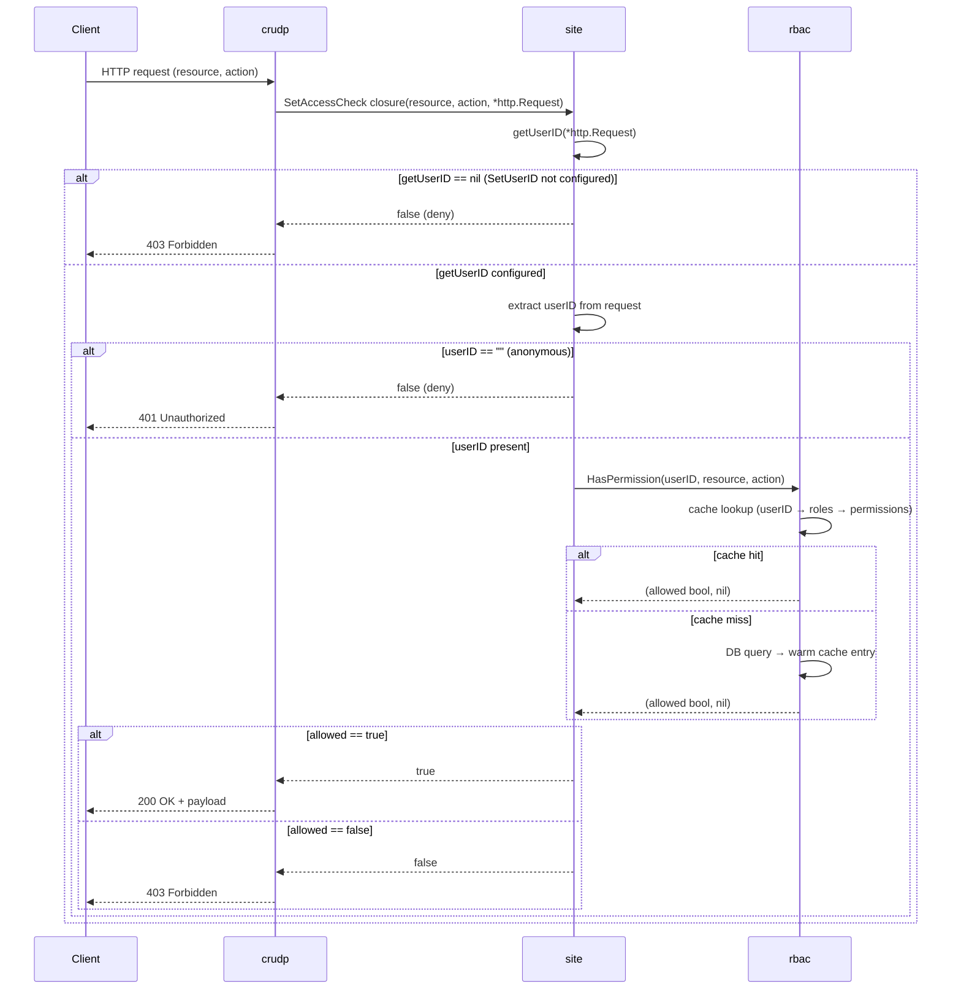

# Access Control Flow

> **Status:** Current — February 2026

Request-time authorization check. Wired at `Mount` time via `crudp.SetAccessCheck`.
`getUserID` is either provided by `site.SetUserID` or auto-wired from session cookie
when `tinywasm/user` is initialized.

## Notes

- `AllowedRoles('r') == []byte{'*'}` (public read) → `HasPermission` still called but
  the wildcard permission is seeded with `*` role, matching all users including anonymous.
- Cache is in-memory (`sync.RWMutex`), populated at `rbac.Init` and updated on `AssignRole`/`RevokeRole`.
- Zero DB I/O on the hot path — all reads served from cache.

## Tests

| Test | Branch covered |
|------|---------------|
| `TestAccessCheck_Anonymous` | empty userID → deny |
| `TestAccessCheck_NoUserIDFunc` | getUserID == nil → deny |
| `TestAccessCheck_Allowed` | valid userID + matching role → allow |
| `TestAccessCheck_Denied` | valid userID + no matching role → deny |
| `TestAccessCheck_PublicRead` | AllowedRoles('r')=='*' → allow anonymous |
