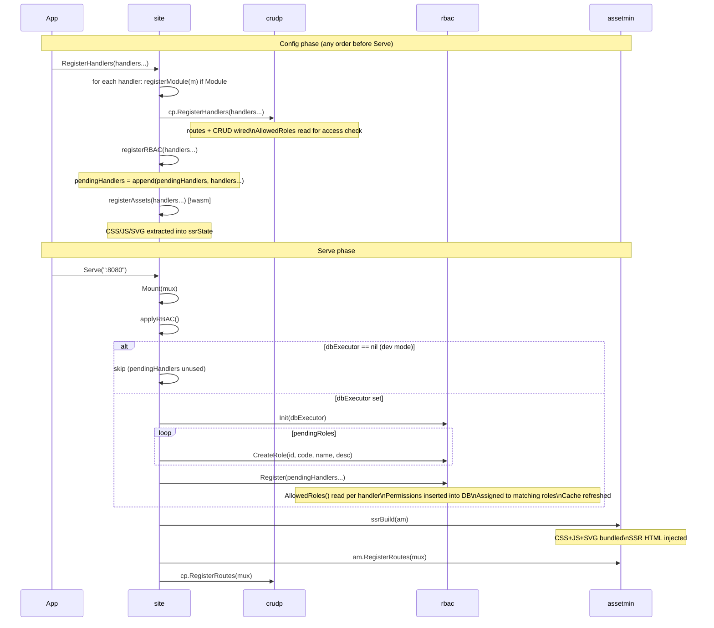

# Register Flow

> **Status:** Current — February 2026

`RegisterHandlers` queues work; `applyRBAC` (called at `Mount`/`Serve`) flushes the queue.
This decoupling allows any call order before `Serve`.

## Key invariants

- `RegisterHandlers` is idempotent per handler (crudp deduplicates routes).
- `registerRBAC` only appends — never calls rbac directly before `applyRBAC`.
- `applyRBAC` is called exactly once per process lifetime.
- Order of `SetDB`, `CreateRole`, `RegisterHandlers` is irrelevant — all must precede `Serve`.

## Tests

| Test | Branch covered |
|------|---------------|
| `TestRegisterFlow_DevMode` | pendingHandlers queued, applyRBAC skips, no panic |
| `TestRegisterFlow_OrderIndependence` | RegisterHandlers before CreateRole works |
| `TestRegisterFlow_EmptyHandlers` | RegisterHandlers() → error "no handlers provided" |
| `TestRegisterFlow_PermissionsSeeded` | after Serve with SetDB, rbac has permissions |
