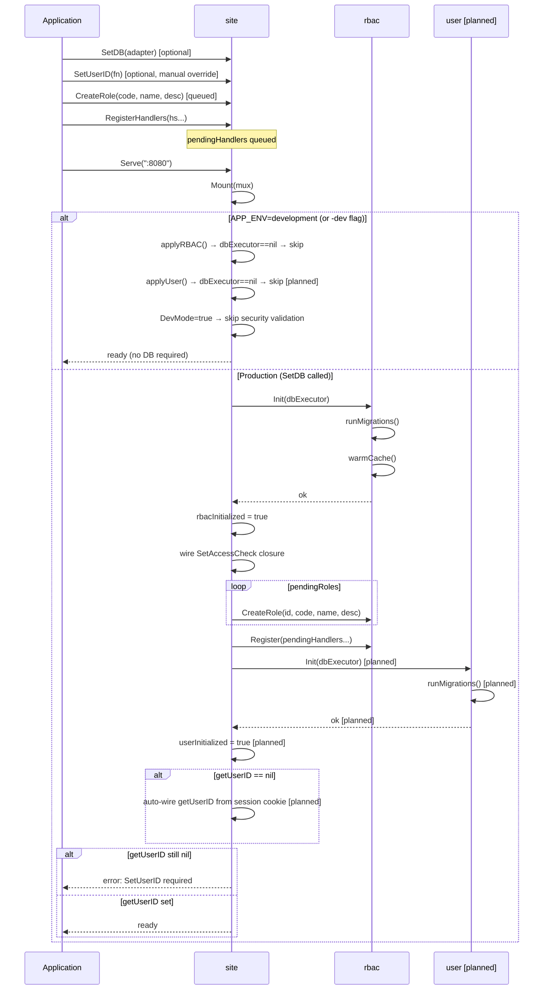

# Setup Flow

> **Status:** Current — February 2026
> `applyUser()` marked as **[planned]** — implemented in a subsequent plan.

Two initialization paths depending on security configuration.

## Tests

| Test | Branch covered |
|------|---------------|
| `TestDevMode_BypassesSecurityCheck` | `APP_ENV=development` → Mount succeeds without SetDB |
| `TestDevMode_FlagArg` | `-dev` flag → DevMode=true |
| `TestProduction_RequiresSetDB` | no SetDB, no dev mode → Mount returns error |
| `TestProduction_SetDB_Success` | SetDB + SetUserID → Mount succeeds |
| `TestProduction_SetDB_NoUserID` | SetDB without SetUserID (no user module) → Mount returns error |
