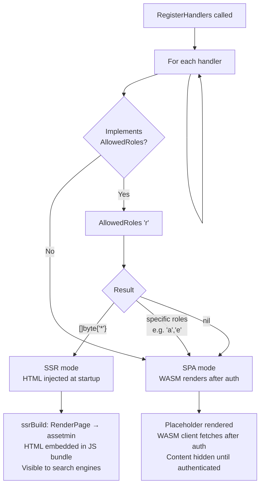

# SSR vs SPA Rendering Decision

> **Status:** Current — February 2026

`RegisterHandlers` inspects `AllowedRoles('r')` on each handler to determine the rendering
mode. This decision is made once at startup — not per request.

## Effect per mode

| Condition | Mode | First paint | SEO | Auth required |
|-----------|------|-------------|-----|---------------|
| `AllowedRoles('r') == []byte{'*'}` | **SSR** | Instant (HTML in bundle) | Indexed | No |
| `AllowedRoles('r') == []byte{'a','e'}` | **SPA** | After WASM load + auth | Not indexed | Yes |
| `AllowedRoles('r') == nil` | **SPA** | After WASM load + auth | Not indexed | Yes |
| Handler has no `AllowedRoles` method | **SPA** | After WASM load + auth | Not indexed | Yes |

## Code reference

`isPublicReadable(h any) bool` in `register_ssr.go` — reads `AllowedRoles('r')` and
checks for `[]byte{'*'}` wildcard.

## Tests

| Test | Branch covered |
|------|---------------|
| `TestSSRDecision_Wildcard` | `AllowedRoles('r')==[]byte{'*'}` → SSR |
| `TestSSRDecision_SpecificRoles` | `AllowedRoles('r')==[]byte{'a'}` → SPA |
| `TestSSRDecision_Nil` | `AllowedRoles('r')==nil` → SPA |
| `TestSSRDecision_NoInterface` | handler without AllowedRoles → SPA |
